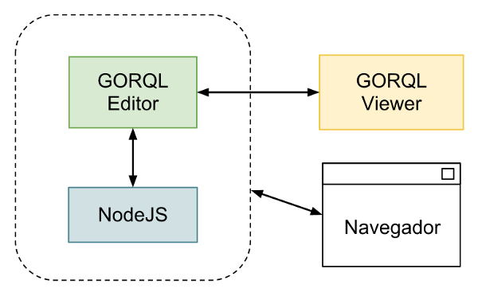

====================
Manual de despliegue
====================

Componentes
===========

Entorno de desarrollo
=====================

El proceso detallado para desplegar GORQL Editor para un entorno de desarrollo
se encuentra en el :doc:`developer`.

Dependencias
============

NodeJS
------

NodeJS es la tecnología sobre la que se ha construido GORQL Editor. Se puede
instalar a partir de un RPM:

*x86_64 RedHat 5*
 Descarga-NodeJS-RH5_

.. _Descarga-NodeJS-RH5: http://files.yaco.es/~ceic-ogov/dependencies/rh5/nodejs-0.6.17-1.x86_64.rpm

*x86_64 RedHat 6*
 Descarga-NodeJS-RH6_

.. _Descarga-NodeJS-RH6: http://files.yaco.es/~ceic-ogov/dependencies/rh6/nodejs-0.6.17-1.el6.x86_64.rpm

Una vez descargado el paquete se instala ejecutando (ej RH5):

.. code-block:: none

 # rpm -Uvh nodejs-0.6.17-1.x86_64.rpm

Este paquete provee NodeJS_ y NPM_ (el sistema de paquetería de NodeJS)
necesarios para el funcionamiento de GORQL Viewer.

.. _NodeJS: http://nodejs.org/
.. _NPM: http://npmjs.org/

Forever
-------

Forever_ es una utilidad que se encarga de monitorizar procesos, y relanzarlos
en caso de que se produzca algún tipo de error.

.. _Forever: https://github.com/nodejitsu/forever

Se puede instalar a partir de un RPM:

*x86_64 RedHat 5*
 Descarga-Forever-RH5_

.. _Descarga-Forever-RH5: http://files.yaco.es/~ceic-ogov/dependencies/rh5/forever-0.9.1-1.x86_64.rpm

*x86_64 RedHat 6*
 Descarga-Forever-RH6_

.. _Descarga-Forever-RH6: http://files.yaco.es/~ceic-ogov/dependencies/rh6/forever-0.9.1-1.x86_64.rpm

Una vez descargado el paquete se instala ejecutando:

.. code-block:: none

 # rpm -Uvh forever-0.9.1-1.x86_64.rpm

Otros
-----

Las librerías que requiere GORQL Editor se distribuyen en el paquete del mismo,
con lo que al instalarlo se instalan también sus dependencias.

GORQL Editor
============

Instalación
-----------

Una vez instalado NodeJS, se puede desplegar GORQL Editor. Para ello se utiliza el
paquete RPM:

*x86_64 RedHat 5*
 Descarga-GORQL-Editor-RH5_

.. _Descarga-GORQL-Editor-RH5: http://files.yaco.es/~ceic-ogov/gorql-editor/1.0/rh5/gorql-editor-1.0.0-3.x86_64.rpm

*x86_64 RedHat 6*
 Descarga-GORQL-Editor-RH6_

.. _Descarga-GORQL-Editor-RH6: http://files.yaco.es/~ceic-ogov/gorql-editor/1.0/rh6/gorql-editor-1.0.0-3.x86_64.rpm

Una vez descargado el paquete se instala ejecutando:

::

 # rpm -Uvh gorql-editor-1.0.0-3.x86_64.rpm

Este paquete incluye GORQL Editor y todas las librerías que utiliza, y crea un
script de servicio para el arranque y parada del servidor.

Los contenidos del paquete se despliegan en `/opt/gorql-editor/`. Los logs se
encuentran en `/opt/gorql-editor/.forever/`.

El servidor escucha, con la configuración por defecto, en el **puerto 3010**.
La configuración del mismo se encuentra en el fichero `settings.js` en el
directorio `/etc/gorql-editor/`.

Actualización
-------------

La actualización de GORQL Editor a nuevas versiones es muy sencilla, dado que
el componente no mantiene un estado. Simplemente hay que actualizar el rpm:

.. code-block:: none

 service gorql-editor stop
 rpm -Uvh gorql-editor-X.Y.Z-W.x86_64.rpm
 service gorql-editor start

Obviamente hay que sustituir X, Y, Z y W por los números de versión
correspondientes.

Con estos comandos queda actualizado el editor.

Gestión del servicio
--------------------

Gracias al script de servicio *gorql-editor* es muy sencillo gestionar el
**arranque**, **parada** y **monitorización** del servidor. Para ello tan sólo
hemos de invocar al servicio con el argumento *start*, *stop* o *status*,
respectivamente.

Para la gestión de este servicio se utiliza Forever_ que se encarga de que el
servidor se relance en caso de que ocurra algún problema.

*Ejemplos de salida*

::

 # service gorql-editor start
 info:   Forever processing file: /opt/gorql-editor/app.js

::

 # service gorql-editor stop
 info:   Forever stopped process:
 data:       uid  command script                 forever pid  logfile                           uptime
 data:   [0] ekL8 node    /opt/gorql-editor/app.js 8101    8102 /opt/gorql-editor/.forever/ekL8.log 0:0:40:0.5

::

 # service gorql-editor status
 info:   Forever processes running
 data:       uid  command script                 forever pid  logfile                           uptime
 data:   [0] ekL8 node    /opt/gorql-editor/app.js 8101    8102 /opt/gorql-editor/.forever/ekL8.log 0:0:39:15.924

Esquema del EndPoint SPARQL
---------------------------

La estructura de los datos del EndPoint se define en un fichero JSON. Dicho
fichero se puede guardar en cualquier parte, pero lo más habitual es que esté
dentro del directorio *endpoints*. En dicho directorio se encuentran dos
ficheros de ejemplo sobre datos de la DBpedia_, que es un proyecto que publica
los datos de la Wikipedia_ a través de un *endpoint* SPARQL en forma de *linked
data*.

.. _DBpedia: http://dbpedia.org/
.. _Wikipedia: http://www.wikipedia.org/

El contenido del fichero se clasifica en **categorías** que a su vez están
compuestas de **colecciones (datasets)**, y éstas de una **definición**,
**prefijos** y **campos**. Los campos son a su vez objetos con su nombre y
otros parámetros.

El fichero es directamente una lista de categorías en formato JSON_. Cada
categoría es un objeto con sus propiedades y una lista de colecciones.

.. _JSON: http://www.json.org/

Categorías
~~~~~~~~~~

Un **categoría** respresenta un grupo de colecciones, y tiene la siguiente
estructura:

.. code-block:: javascript

    {
        "name": "Nombre para la interfaz",
        "collections": [{...}, {...}, {...}, ...]
    }

Como se puede ver, cada categoría sólo tiene dos atributos: un nombre para la
interfaz y una lista de colecciones.

Colecciones
~~~~~~~~~~~

Una **colección** representa un grupo de elementos del mismo tipo y que tienen
los mismos campos, y tiene la siguiente estructura:

.. code-block:: javascript

    {
        "name": "Nombre para la interfaz",
        "identifier": "nombre_codigo_unico",
        "definition": ["<def1>", "<def2>", ...],
        "prefixes": {
            "pref_key_1": "<prefix1>",
            "pref_key_2": "<prefix2>",
            ...
        },
        "fields": [{...}, {...}, {...}, ...]
    }

Los atributos que componen las colecciones son:

*name*
    Un nombre para mostrar al usuario en la interfaz.

*identifier*
    Un identificador único de uso interno. No debe repetirse, y no puede
    contener caracteres especiales (Especificación_).

.. _Especificación: http://www.w3.org/TR/sparql11-query/#rVARNAME

*definition*
    Una serie de condiciones SPARQL que definen la colección. Se explica con
    mayor detalle a continuación.

*prefixes*
    Una lista de prefijos SPARQL. Se explica con mayor detalle a continuación.

*fields*
    Una lista con los campos de la colección.

El atributo **definition** es una lista de patrones SPARQL que permiten definir
la colección como tal. En SPARQL, los elementos que forman la sección WHERE se
suelen llamar *patterns*, y son condiciones que deben cumplir las tripletas
para ser escogidas. Esta lista de patterns son las condiciones que una tripleta
debe cumplir para ser considerada parte de la colecciones.

El formato en el que se escriben es muy parecido al de SPARQL. En SPARQL cada
pattern está compuesto de 3 elementos: sujeto, predicado y objeto, en ese
orden. Es decir, algo como:

.. code-block:: none

    ?subject ?predicate ?object .

Donde los elementos pueden ser variables o literales. En el caso del campo
*definition* los patterns son del tipo:

.. code-block:: none

    predicate object

Donde no aparece el sujeto (que será una variable en la consulta SPARQL final),
y el predicado y el objeto no pueden ser variables, deben ser literales. Hay
que destacar también la ausencia del "." al final.

Un ejemplo para definir una colección como "Novelistas españoles" a partir de
los datos de la DBpedia_ sería:

.. code-block:: javascript

    "definition": [
        "<http://purl.org/dc/terms/subject> <http://dbpedia.org/resource/Category:Spanish_novelists>"
    ]

La condición que se está estableciendo en este caso es que los objetos tengan
como valor del atributo `<http://purl.org/dc/terms/subject>` el literal
`<http://dbpedia.org/resource/Category:Spanish_novelists>`. Todo objeto que
cumpla esta condición será un miembro de la colección. En este ejemplo sólo hay
una condición, pero podrían ser varias, y por ello el atributo *definition*
debe ser una lista.

El atributo **prefixes** es un diccionario de prefijos SPARQL, donde la clave
es el nombre en código del prefijo, y que se usará después para asignar
prefijos a los campos, y el valor es la URI_ del prefijo.

.. _URI: http://www.w3.org/TR/2004/REC-rdf-concepts-20040210/#dfn-URI-reference

En SPARQL los prefijos se utilizan para que sea más cómodo, al escribir los
patterns del WHERE, especificar el *namespace* de cada literal. La sintaxis
SPARQL es:

.. code-block:: none

    PREFIX code: <http://www.example.com/uri>

Mientras que en el atributo *prefixes* se escribiría como un par clave valor
tal que así:

.. code-block:: none

    "code": "<http://www.example.com/uri>"

La clave en JSON debe ser una cadena, de ahí las comillas. Un ejemplo completo
del diccionario con los prefijos sería:

.. code-block:: javascript

    "prefixes": {
        "rdfs": "<http://www.w3.org/2000/01/rdf-schema#>",
        "dbpprop": "<http://dbpedia.org/property/>"
    }

Al generarse la consulta este diccionario de prefijos se trasladaría a la
sintaxis de SPARQL. La clave de cada elemento del diccionario es la que se debe
usar luego en los nombres código de los campos que pertenezcan a ese namespace.

Campos
~~~~~~

Un **campo** tiene la siguiente estructura:

.. code-block:: javascript

    {
        "code": "prefijo:nombre_codigo",
        "name": "Nombre para la interfaz",
        "type": "type_name",
        "parameters": {
            "param1": param_value1,
            "param2": param_value2,
            ...
        }
    }

Los atributos que componen los campos son:

*code*
    Pareja de prefijo y nombre del campo en el endpoint. No puede repetirse
    dentro de una colección. El prefijo es la clave del diccionario de
    prefijos para el prefijo deseado. No puede contener caracteres especiales
    (`Especificación`__).

.. _Especif2: http://www.w3.org/TR/sparql11-query/#rPNAME_LN

__ Especif2_

*name*
    Un nombre para mostrar al usuario en la interfaz.

*type*
    El tipo al que pertenece el campo. Si la fuente de datos es de calidad,
    el valor de este campo en todos los objetos de la colección será del
    mismo tipo. Los posibles valores son:

    string
        Cadena de texto.
    number
        Número, puede ser entero o flotante.
    date
        Fecha en formato YYYY-MM-DD.
    coord
        Coordenada geográfica, latitud o longitud.
    uri
        URI_ a otros objetos del endpoint.

*parameters*
    Objeto **opcional** con los parámetros del widget de filtrado
    correspondiente al tipo del campo. Es decir, aquí se definen con qué
    valores y opciones se mostrará la interfaz de usuario para filtrar por
    este campo. Al ser opcional este atributo puede no aparecer.

En la interfaz para definición de filtros se muestran una serie de controles y
widgets, mediante los **parameters** de cada campo se controla qué permite
dicha interfaz hacer. Estos *parameters* dependen del tipo del campo:

- *string*: Ninguno.
- *number*:

  - *min*: Mínimo valor para el filtro.
  - *max*: Máximo valor para el filtro.
  - *step*: Salto mínimo entre un valor posible y el siguiente.

- *date*:

  - *min*: Mínimo valor para el filtro.
  - *max*: Máximo valor para el filtro.

- *coord*: Los mismos que para el tipo number.
- *uri*: Ninguno.

Que un tipo de campo no tenga parámetros no quiere decir que no se pueda
filtrar por los campos de dicho tipo, tan sólo que los filtros posibles son
iguales idenpendientemente del campo que sea (mientras sea de ese tipo).

Ejemplo de un campo de typo "date":

.. code-block:: javascript

    {
        "code": "dbpprop:releaseDate",
        "name": "Fecha de publicación",
        "type": "date",
        "parameters": {
            "min": "1000-01-01",
            "max": "2050-01-01"
        }
    }

Y otro de tipo "number":

.. code-block:: javascript

    {
        "code": "dbpedia-owl:populationTotal",
        "name": "Población",
        "type": "number",
        "parameters": {
            "min": 0,
            "max": 50000000,
            "step": 10000
        }
    }

Es decir, que para los filtros del campo "Población" el mínimo valor que puede
introducir el usuario es cero, el máximo 50 millones, y cada paso es de 10000
habitantes.

Con esto se completa el contenido del esquema del endpoint. En el directorio
`/opt/gorql-editor/endpoints/` se encuentran dos ficheros de ejemplo con
esquemas completos para colecciones de datos de la DBpedia_.

Configuración
-------------

La configuración del editor se encuentra en el directorio `/etc/gorql-editor/`.

settings.js
~~~~~~~~~~~

Éste es el fichero principal de configuración de GORQL Editor. Incluye tres
grupos de parámetros: *global*, *development* y *production*. Que son opciones
globales para todos los casos, específicas para entornos de desarrollo, y
específicas para entornos de producción, respectivamente.

Por defecto, si se arranca el visor mediante el script de servicio, el modo
utilizado es *Production*.

El formato es JSON. Las opciones de desarrollo y producción son las mismas, se
utiliza un grupo u otro según se arranque el editor en un modo u otro.

El fichero trae una configuración de ejemplo.

Global
''''''

- **staticUrl**: Ruta donde se sirven los ficheros estáticos, sólo es necesario
  modificar este parámetro si se desea servir los ficheros estáticos por
  separado. Por defecto, *""*.
- **debug**: Modo depuración, para el funcionamiento normal debe estar
  desactivado. Por defecto, *false*.
- **port**: Puerto en el que escucha el editor. Por defecto, *3010*.
- **viewer**: Dominio en el que se encuentra GORQL Viewer. Por defecto,
  *http://gorql-viewer.ceic-ogov.yaco.es*. Es importante que no tenga */* al
  final de la url.
- **schema**: Fichero JSON con la definición de las colecciones del endpoint a
  utilizar. Por defecto, *endpoints/dbpedia.json*.
- **language**: Objeto con los idiomas para ofrecer al usuario en el filtro de
  idioma, y opcionalmente un idioma por defecto para el filtro. No se refiere
  al idioma en que se le sirve la plataforma al usuario.

  - **defaultFilter**: Código del idioma por defecto. Si se configura y no es
    la cadena vacía, entonces al usuario no se le permite crear filtros de
    idioma, sino que se filtra siempre por el idioma aquí configurado. Por
    defecto, *es*.
  - **userFilters**: Lista con los idiomas por los que el usuario podrá filtrar,
    no es necesario rellenarlo si el parámetro *defaultFilter* está presente.
    Por defecto se incluye inglés y español.

- **logo**: Ruta a la imagen para la cabecera del editor. Por defecto,
  *images/logo-big.png*.
- **title**: Título del editor que aparecerá en la cabecera. Por defecto,
  *Asistente de Construcción de Consultas*.

.. note::

    Para personalizar el aspecto de la cabecera del editor hay que modificar
    los parámetros **logo** y **title** que se acaban de comentar.

Development y Production
''''''''''''''''''''''''

Las siguientes son opciones de la plataforma, el usuario final no podrá escoger
valores diferentes a los que el administrador haya configurado aquí:

- **previewLimit**: Número máximo de registros mostrados en la tabla de
  resultados de la previsualización. Por ejemplo, *10*.
- **availableCharts**: Objeto JSON con la lista de gráficos disponibles para
  el usuario, agrupados por familias. Para activar o desactivar un gráfico
  sólo hay que añadirlo o quitarlo de la familia correspondiente. La lista
  completa de gráficos según familias es:

  - **d3**: *bar*, *line* y *pie*
  - **simile**: *timeline*
  - **map**: *map* y *mapea*
