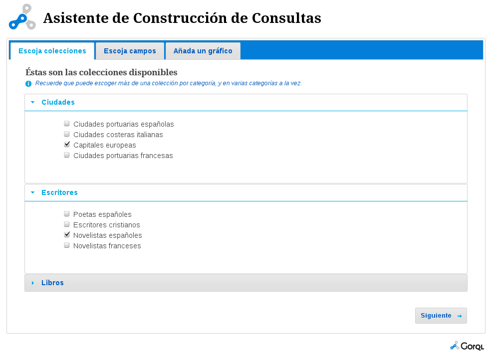
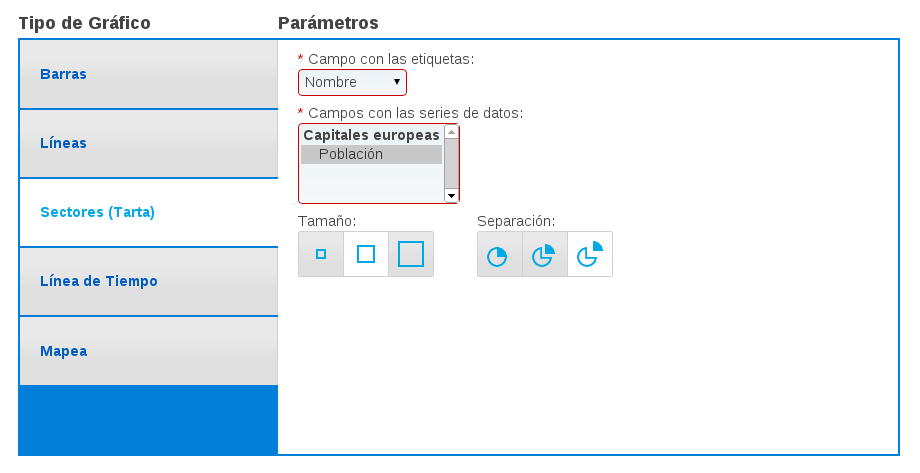
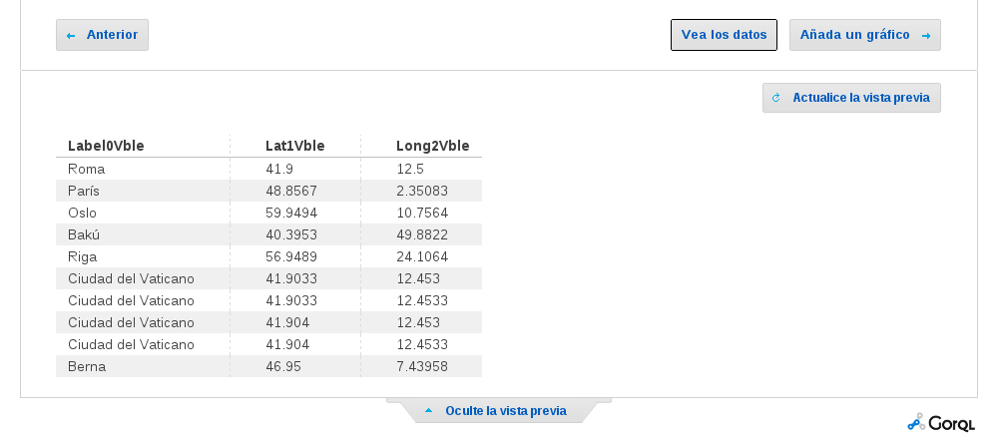

==================
Manual del usuario
==================

Pasos de definición de la consulta
==================================

La generación de una consulta está subdividida en una serie de pasos o
pestañas. En cada uno de los pasos se van definiendo los diferentes aspectos de
la consulta. Está organizado en pasos porque cada uno depende de los
anteriores, por lo que los cambios que se hagan en los primeros pasos
afectarían a los siguientes.

Escoger colecciones
-------------------

Se muestra un listado de colecciones, agrupadas por categorías. El usuario
puede escoger qué categorías intervendrán en las consulta.

Escoger campos
--------------

Se muestra un listado de campos, agrupados según las colecciones escogidas en
el paso anterior. El usuario puede escoger qué campos solicitar al *endpoint*
en la consulta.

Además se le ofrecen una serie de opciones avanzadas que permiten refinar la
consulta.

Conectar colecciones
~~~~~~~~~~~~~~~~~~~~

En el momento en que se escoge un campo que permite realizar conexiones entre
colecciones (aparecen resaltados), se muestra la interfaz para conectar
colecciones que hasta entonces permanece oculta.

En dicha intergaz se muestra un selector con un listado de los campos escogidos
que son de tipo *uri*, es decir, que apuntan a otros recursos. Al escoger uno
de estos campos, hay que escoger a continuación la colección con la que
conectarlo.

De esta forma los resultados correspondientes a la segunda colección serán
aquellos apuntados por los registros de la primera, creándose así una
conexión entre ambas colecciones.

Filtrar resultados
~~~~~~~~~~~~~~~~~~

Los filtros se encuentran en el segundo paso, bajo las *Opciones avanzadas*.

Se muestra un listado de los campos escogidos. Cuando el usuario escoge un
campo se le muestra un listado de filtros aplicables al campo según el tipo al
que pertenezca.

El usuario puede escoger entonces el filtro a aplicar, y el valor o valores
límite.

Añadir gráfico
--------------

Este paso es opcional, pero altamente recomendable.

Se ofrecen los diferentes tipos de gráficos soportados por el componente GORQL
Viewer, y también campos para escoger los parámetros de configuración del
gráfico escogido. Estos campos cambiarán a medida que se escoja un tipo de
gráfico u otro.

Entre los parámetros del gráfico se encuentran los selectores de los campos
que servirán para construir el gráfico. Sólo se mostrarán aquellos campos que
sean del tipo compatible con el gráfico escogido. Por ejemplo, un campo de
tipo fecha no sirve para hacer un gráfico de sectores, hacen falta campos
numéricos.

Previsualización
================

La solapa para *Vista previa* está presente en el segundo y tercer paso, pero
tiene un significado diferente en cada uno de ellos.

Al pulsar en la solapa se abre la previsualización de la consulta.

En el segundo paso, la previsualización generada es la tabla de datos con los
resultados obtenidos por la consulta.

En el otro caso, durante el tercer paso, la previsualización generada será el
gráfico escogido.

.. image:: _images/preview3.png

Es posible actualizar la previsualización con los cambios en la consulta que se
hayan hecho. Para ello hay que pulsar en el botón *Actualice la vista previa*,
que aparece al mostrarse las previsualizaciones.

Ver datos y gráfico en GORQL Viewer
===================================

En el paso de escoger campos y en el de definición del gráfico se muestran
sendos botones para abrir el informe construido en GORQL Viewer. Estos botones,
resaltados con un borde negro, abrirán en una nueva ventana/pestaña el
componente GORQL Viewer con el informe.

Si se pulsa el botón del segundo paso, el informe que se abrirá no tendrá
ningún gráfico.

Si en cambio se pulsa el del paso del gráfico, el informe contendrá la tabla de
resultados y el gráfico definido.
